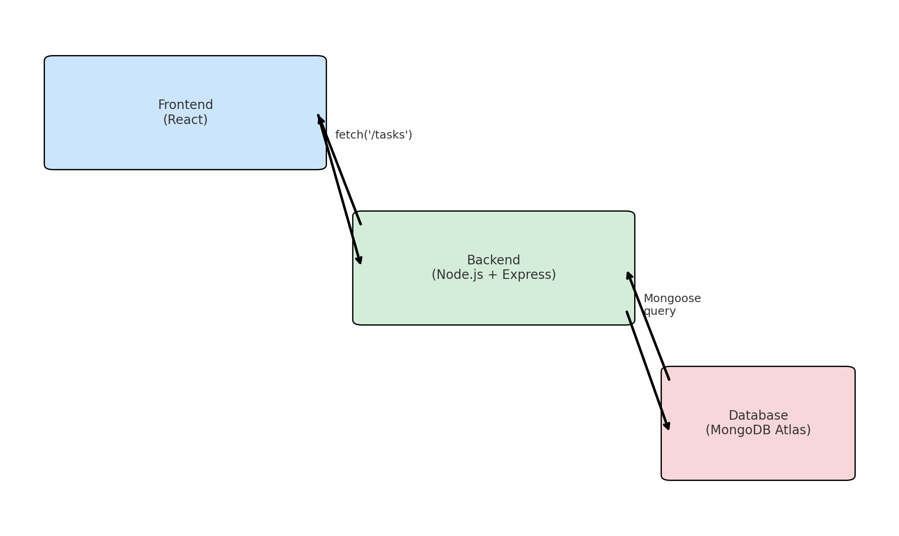

# 🧠 Weekend Full-Stack Project: Task Manager (Interview Prep Edition)

> ⏱ **Time**: ~12 hours  
> 📦 **Stack**: React (Frontend) • Express + Node.js (Backend) • MongoDB Atlas (Database)  
> 🚀 **Deployment**: Vercel (Frontend) • Render (Backend)

---

## 🧩 What is a Full-Stack Application?

A **full-stack app** connects everything needed to deliver a complete user experience:

| Layer       | Role                                 | Tech Used in This Project     |
|-------------|---------------------------------------|-------------------------------|
| **Frontend** | UI the user sees and interacts with   | React                         |
| **Backend**  | Server logic + API for data exchange  | Node.js + Express             |
| **Database** | Stores persistent data                | MongoDB Atlas (cloud-hosted)  |V
| **API Layer**| Allows frontend to talk to backend    | RESTful API (`fetch`/`axios`) |
| **Deployment** | Makes your app accessible online   | Vercel + Render               |

> **Why this matters for interviews**: You demonstrate end-to-end understanding — UI, APIs, database, and deployment — all in one project.

---
## 🧠 Quick Tech Summary

- **Node.js** – Runs JavaScript on the server to power your backend logic.
- **Express.js** – Helps define and handle API routes like `GET /tasks` and `POST /tasks`.
- **React** – Builds the interactive user interface (UI) that users see and click on.
- **MongoDB Atlas** – Stores your app’s data (like tasks) in the cloud using a flexible NoSQL structure.
- **Mongoose** – Makes it easier to talk to MongoDB from Node.js using schemas and models.
- **Vercel** – Hosts and deploys your frontend React app to the web.
- **Render** – Hosts and runs your backend server + connects to your database.

---
## 🔄 Understanding Frontend–Backend–Database Interaction

A full-stack web app is made of **three layers** that work together to process user actions and manage data:

---

### 🖼️ Frontend (Client-Side)
- **What it is**: The user interface — buttons, forms, lists, etc.
- **What it does**: Captures user input (e.g. typing a task, clicking "Add")
- **How it communicates**: Sends HTTP requests (like `fetch()` or `axios`) to the backend
- **Example**: `POST /tasks` when a user submits a new task

---

### 🧠 Backend (Server-Side)
- **What it is**: The brain of the app — handles logic and processing
- **What it does**:
  - Receives requests from the frontend
  - Processes data
  - Talks to the database
  - Sends back responses
- **Example**: When the frontend sends `POST /tasks`, the backend saves the task to the database and returns it

---

### 💾 Database
- **What it is**: A structured data store (MongoDB Atlas in this project)
- **What it does**:
  - Saves tasks persistently
  - Responds to queries (e.g. "get all tasks", "delete this task")
- **Example**: When the backend calls `Task.find()`, the database returns all saved tasks

---

### 🧭 Summary Flow

1. **User submits a task** (in the frontend)
2. **Frontend sends POST request** to backend API
3. **Backend processes the request**, saves the task to the database
4. **Database stores the task**
5. **Backend sends response** back to frontend
6. **Frontend updates the UI** with the new task
---
### 🔧 Analogy: How Node.js + Express + API Work Together

| Component   | Real-World Analogy                                |
|-------------|---------------------------------------------------|
| **Node.js** | The kitchen – where the work (logic) is done      |
| **Express** | The head chef – organizes recipes (routes)        |
| **Your API**| The waiter – takes orders and returns responses   |

### 📚 Is Node.js or Express.js a Framework?

| Tool         | Type                          | What It Does                                                       |
|--------------|-------------------------------|---------------------------------------------------------------------|
| **Node.js**  | JavaScript Runtime (❌ Not a framework) | Lets you run JavaScript outside the browser (on servers, locally) |
| **Express.js** | Web Framework (✅ Yes, a framework) | Built on Node.js — helps you create APIs and handle routes easily  |

#### Summary:
- **Node.js** is the engine that powers backend JavaScript.
- **Express.js** is the toolkit that helps you build with it faster.

---
## 🧠 Full-Stack Tool Comparison: What They Are & When They’re Used

| Tool          | Type                   | Used in Dev? | Used in Prod? | What It Does                                                                 |
|---------------|------------------------|--------------|----------------|------------------------------------------------------------------------------|
| **Vite**      | Development Tool       | ✅ Yes       | ❌ No         | Serves your frontend locally and builds production-ready assets             |
| **React**     | Library                | ✅ Yes       | ✅ Yes        | Builds dynamic UI components on the frontend                                |
| **Node.js**   | Runtime Environment    | ✅ Yes       | ✅ Yes        | Executes JavaScript backend code on your machine or on a server             |
| **Express**   | Framework              | ✅ Yes       | ✅ Yes        | Provides structure for building backend APIs and handling routes            |
| **Mongoose**  | Library (ODM)          | ✅ Yes       | ✅ Yes        | Connects Node.js to MongoDB and adds schema, validation, and queries        |
| **MongoDB Atlas** | Cloud Database    | ✅ Yes       | ✅ Yes        | Stores data (e.g., tasks) in the cloud using a flexible document structure  |

---

### 🔍 Summary

- **Vite** is a fast local dev server and build tool — it's used only during development for frontend work.
- **React** is a JavaScript library used to build the frontend UI — used in both development and production.
- **Node.js** runs JavaScript outside the browser — it's what powers your backend server in both dev and prod.
- **Express** is a lightweight backend framework for handling routing and APIs — runs within Node.js.
- **Mongoose** is a helper library that makes working with MongoDB in Node.js cleaner and more structured.
- **MongoDB Atlas** is your cloud-hosted database — it holds your persistent data and is used in all environments.

---

### 🧪 Use Case Examples

| Scenario                                   | Vite | React | Node.js | Express | Mongoose | MongoDB Atlas |
|--------------------------------------------|------|--------|----------|----------|-----------|----------------|
| Frontend development (`npm run dev`)       | ✅    | ✅     | ❌       | ❌       | ❌        | ❌             |
| Frontend deployed (on Vercel)              | ❌    | ✅     | ❌       | ❌       | ❌        | ✅             |
| Backend development (`node index.js`)      | ❌    | ❌     | ✅       | ✅       | ✅        | ✅             |
| Backend deployed (on Render)               | ❌    | ❌     | ✅       | ✅       | ✅        | ✅             |


---
## 🐍 What is Mongoose?

**Mongoose** is a JavaScript library (ODM) that helps your Node.js app interact with **MongoDB** more easily and safely.

### ✅ What It Does:
- Defines **schemas** (data structure) and **models** (query tools)
- Adds **validation** and structure to MongoDB (which is schema-less by default)
- Simplifies CRUD operations with methods like `.find()`, `.save()`, `.deleteOne()`

### 🔍 Example:
```js
const TaskSchema = new mongoose.Schema({
  title: String,
  completed: Boolean
});
const Task = mongoose.model('Task', TaskSchema);
```

### 💡 Why Use It?
- Cleaner and more consistent code
- Enforces data structure and reduces bugs
- Perfect for connecting Express apps to MongoDB

---
### 🔄 Full-Stack Request Flow
#### The route `/tasks` is defined in your Express API handlers, like this:
```js
app.get('/tasks', async (req, res) => {
  // logic to fetch tasks
});
```



---

## 🛠️ Part 0: Install Your Tools (~30 mins)

These tools form the foundation of your development workflow:

| Tool            | What It Does                                  | Why You Need It                                            |
|------------------|-----------------------------------------------|-------------------------------------------------------------|
| [**Node.js**](https://nodejs.org) | JavaScript runtime on your computer          | Required for running backend (Express) and `npm` packages  |
| **npm** (included with Node.js) | Installs JS libraries                     | Used to install React, Express, etc.                        |
| [**VS Code**](https://code.visualstudio.com) | Code editor + terminal                  | Popular editor with built-in terminal + extensions          |
| [**MongoDB Atlas**](https://www.mongodb.com/cloud/atlas) | Online NoSQL database                   | Stores tasks persistently, accessible via Mongoose         |
| [**Postman**](https://www.postman.com) | Test and inspect API endpoints         | Lets you test backend before connecting frontend            |
| [**Git + GitHub**](https://github.com) | Version control + remote repo hosting | Makes deployment and source control easier                  |

---

## ✅ Project Overview

You’ll build a **Task Manager** where users can:
- ✅ Add a new task
- 📋 View the full task list
- ❌ Delete a task
- (Optional 🧠: Mark a task complete)

---

## 📅 **Day-by-Day Plan (~12 Hours Total)**

### **🕓 Friday Evening (1.5 Hours) – Setup + System Design**

#### ✅ What You'll Do:
- Install tools (above)
- Plan project folder structure
- Understand frontend/backend/database interaction


#### 📂 Folder Structure:
```
task-manager/
├── backend/      ← Express server, API routes, DB logic
└── frontend/     ← React app (UI, API calls)
```

#### 💡 Why:
- Clean separation between frontend and backend
- Makes it easier to develop, test, and deploy independently

---

### **🧱 Saturday Morning (4 Hours) – Build the Backend**

#### ✅ What You'll Build:
- Node.js + Express server
- MongoDB connection (using Mongoose)
- RESTful API: `GET`, `POST`, and `DELETE` endpoints

#### 🔧 Commands:
```bash
mkdir backend && cd backend
npm init -y
npm install express mongoose cors dotenv
```

#### 📄 Sample `index.js`:
```js
const express = require('express');
const mongoose = require('mongoose');
const cors = require('cors');
require('dotenv').config();

const app = express();
app.use(cors());
app.use(express.json());

mongoose.connect(process.env.MONGO_URI).then(() => console.log("Connected to DB"));

const Task = mongoose.model('Task', new mongoose.Schema({ title: String, completed: Boolean }));

app.get('/tasks', async (req, res) => res.json(await Task.find()));
app.post('/tasks', async (req, res) => res.status(201).json(await new Task(req.body).save()));
app.delete('/tasks/:id', async (req, res) => { await Task.findByIdAndDelete(req.params.id); res.sendStatus(204); });

app.listen(3001, () => console.log("API running on port 3001"));
```

#### 🔍 Why This Matters:
- Demonstrates you can design a REST API
- You know how to connect backend code to a cloud-hosted database
- You separate logic and data correctly — a key interview trait

---
## 🧠 What We're Doing (Frontend Summary)

We're building the **React frontend** for our full-stack Task Manager app.  
This UI connects to our backend API and lets the user:

- ✅ View the task list
- ✅ Add a new task
- ✅ Delete a task
- ✅ Toggle a task's completion status

---

## 🔍 Why Each Step Matters

| Step                     | What It Does                                          | Why It’s Important                                                   |
|--------------------------|-------------------------------------------------------|----------------------------------------------------------------------|
| Create React app (Vite)  | Sets up a modern, fast development environment        | Shows familiarity with React + tooling (a common interview expectation) |
| `useEffect()`            | Fetches data when the app loads                       | Demonstrates handling side effects and loading external data         |
| `useState()`             | Manages form input and task list                      | React fundamentals — state is at the heart of frontend development  |
| `fetch()` calls          | Sends HTTP requests to backend (`GET`, `POST`, etc.) | Shows real-world experience calling APIs and integrating with a backend |
| Add/Delete/Patch UI      | Lets user interact with the app via buttons, forms    | Proves you can build a working, user-friendly interface             |
| Connected to backend     | Uses `localhost:3001/tasks` to persist data           | Shows full-stack knowledge: frontend ←→ API ←→ database              |

---

By the end of this section, you've built a working **React UI** that talks to a real backend and database — the **core of any full-stack web app**.

This is exactly the kind of project you can walk through confidently in a technical interview.


---

### **🎨 Saturday Afternoon (4 Hours) – Build the Frontend**

#### ✅ What You'll Build:
- React UI
- Form to add new tasks
- Task list display with delete buttons
- Connect frontend to backend using `fetch()` or `axios`

#### 🔧 Commands:
```bash
npm create vite@latest frontend -- --template react
cd frontend
npm install
```

#### 🧠 Frontend Concepts:
| Concept | What It Does | Example |
|--------|---------------|---------|
| `useState` | Holds form and task list data | `const [tasks, setTasks] = useState([])` |
| `useEffect` | Runs on component load | `useEffect(() => { fetchTasks() }, [])` |
| `fetch()` | Calls backend API | `fetch('/tasks').then(...)` |

#### 🔍 Why This Matters:
- Shows you can handle state and forms in React
- Demonstrates end-to-end understanding: UI → API → DB
- Prepares you for real-world interview tasks (like building a mini CRUD app)

---
## ⚡ What is Vite?

**Vite** is a modern frontend build tool and development server that makes working with JavaScript frameworks like **React** lightning-fast and easy.

> Created by Evan You (creator of Vue.js), Vite is now a popular alternative to Create React App (CRA).

---

### ✅ Why We Use Vite in This Project

- ⚡ **Fast dev server startup** — near-instant reloads
- 🧠 **Simpler configuration** — no need to tweak Webpack or Babel
- 🛠️ **Out-of-the-box support** for React, JSX, CSS modules, and more
- 📦 **Optimized production builds** with Rollup under the hood

---

### 🟢 How We Set It Up

```bash
npm create vite@latest frontend -- --template react
cd frontend
npm install
npm run dev
```

> Your app will run at `http://localhost:5173`

---

### 🧠 Summary

| Feature               | What It Does                                 |
|-----------------------|----------------------------------------------|
| **Dev Server**        | Serves your app with lightning-fast reloads  |
| **Build Tool**        | Creates optimized bundles for deployment     |
| **Modern Defaults**   | Works with ES modules, JSX, TypeScript, etc. |

Vite keeps your frontend workflow modern, fast, and simple — ideal for full-stack apps and interview prep.

---
## 🎨 Saturday Afternoon – Build the Frontend

### ✅ Step 1: Create React App with Vite

```bash
npm create vite@latest frontend -- --template react
cd frontend
npm install
```

> This creates a modern React project in the `frontend/` folder.

---

### ✅ Step 2: Start the Dev Server

```bash
npm run dev
```

Open `http://localhost:5173` in your browser to view the app.

---

### ✅ Step 3: Replace App.jsx with the Task Manager UI

In `frontend/src/App.jsx`, replace all content with:

```jsx
import { useEffect, useState } from 'react';

function App() {
  const [tasks, setTasks] = useState([]);
  const [title, setTitle] = useState('');

  useEffect(() => {
    fetch('http://localhost:3001/tasks')
      .then(res => res.json())
      .then(setTasks);
  }, []);

  const addTask = async () => {
    const res = await fetch('http://localhost:3001/tasks', {
      method: 'POST',
      headers: { 'Content-Type': 'application/json' },
      body: JSON.stringify({ title, completed: false })
    });
    const newTask = await res.json();
    setTasks([...tasks, newTask]);
    setTitle('');
  };

  const deleteTask = async (id) => {
    await fetch(`http://localhost:3001/tasks/${id}`, { method: 'DELETE' });
    setTasks(tasks.filter(t => t._id !== id));
  };

  const toggleComplete = async (task) => {
    const res = await fetch(`http://localhost:3001/tasks/${task._id}`, {
      method: 'PATCH',
      headers: { 'Content-Type': 'application/json' },
      body: JSON.stringify({ completed: !task.completed })
    });
    const updated = await res.json();
    setTasks(tasks.map(t => (t._id === updated._id ? updated : t)));
  };

  return (
    <div style={{ padding: 20, maxWidth: 500, margin: '0 auto' }}>
      <h1>🧠 Task Manager</h1>

      <input
        placeholder="Enter new task"
        value={title}
        onChange={e => setTitle(e.target.value)}
        style={{ padding: 8, width: '70%' }}
      />
      <button onClick={addTask} style={{ padding: 8, marginLeft: 10 }}>
        Add
      </button>

      <ul style={{ listStyle: 'none', padding: 0, marginTop: 20 }}>
        {tasks.map(task => (
          <li key={task._id} style={{ marginBottom: 10 }}>
            <input
              type="checkbox"
              checked={task.completed}
              onChange={() => toggleComplete(task)}
            />
            <span style={{ marginLeft: 8, textDecoration: task.completed ? 'line-through' : 'none' }}>
              {task.title}
            </span>
            <button onClick={() => deleteTask(task._id)} style={{ marginLeft: 10 }}>
              ❌
            </button>
          </li>
        ))}
      </ul>
    </div>
  );
}

export default App;
```

---

### ✅ At This Point, You Can:
- Add new tasks via the input field
- Check/uncheck tasks using the checkbox
- Delete tasks with the ❌ button

✅ Everything is connected to your backend at `http://localhost:3001`

Ready to deploy? Or want to style it with Tailwind next?

---

### **🚀 Sunday (2–3 Hours) – Polish + Deploy**

#### ✅ What You'll Do:
- Add task completion toggle (`PATCH`)
- Deploy backend to **Render**
- Deploy frontend to **Vercel**
- Test final app live

#### 🌐 Deployment Summary:

| Part      | Platform | How |
|-----------|----------|-----|
| Backend   | [Render](https://render.com) | Create Web Service → connect GitHub → add `MONGO_URI` in env vars |
| Frontend  | [Vercel](https://vercel.com) | Connect GitHub → deploy → update API base URL |

#### 🔍 Why This Matters:
- Shows you understand environment variables and deployment workflows
- Prepares you to explain CI/CD pipelines and dev environments

---
## ✅ Sunday – Polish + Deploy (~3–4 Hours)

---

### 🎨 1. Polish the App (1–1.5 hrs)

#### ✅ Goal:
Improve user experience and make the project feel complete.

#### 🔧 Optional Enhancements:
- 🧼 **Reset input field** after adding a task (already done!)
- ✅ **Show a loading state** while fetching tasks
- ❌ **Handle errors** with `try/catch` blocks
- 🎨 **Basic styling** (use CSS or Tailwind)
- 🧠 **Display message if no tasks exist**
- 📆 **(Stretch)**: Add due dates or task categories

#### 💡 Why:
Shows you understand user experience, code clarity, and clean UI practices — very interview-relevant.

---

### 🚀 2. Deploy the App (2–2.5 hrs)

#### ✅ Goal:
Make your project live so it’s shareable and portfolio-ready.

---

### 📦 Backend: Deploy to [Render](https://render.com)

#### Steps:
1. Push your `backend/` folder to GitHub
2. Go to **Render** → New → Web Service
3. Connect your GitHub repo
4. Fill in:
   - **Build Command**: `npm install`
   - **Start Command**: `node index.js`
5. Add **Environment Variable**:
   - `MONGO_URI=your_mongodb_connection_string`
6. Click **Deploy**

📍 After deployment, copy the live API base URL (e.g., `https://your-backend.onrender.com`)

---

### 🌐 Frontend: Deploy to [Vercel](https://vercel.com)

#### Steps:
1. Push your `frontend/` folder to GitHub (or the same repo in `/frontend`)
2. Go to **Vercel** → New Project
3. Select your repo
4. Set:
   - **Root Directory**: `frontend`
5. Vercel will auto-detect Vite and deploy

📍 After deployment, Vercel gives you a public URL (e.g., `https://your-frontend.vercel.app`)

---

### 🔁 Update API Base URL in `App.jsx`

```js
// Replace 'http://localhost:3001' with your live backend URL
const API = 'https://your-backend.onrender.com';

fetch(`${API}/tasks`);
```

> 💡 Use `import.meta.env` and `.env` file for more advanced config (optional)

---

### ✅ Final Checklist

| Task                               | Done? |
|------------------------------------|--------|
| React app runs on Vercel          | ✅     |
| Backend API runs on Render        | ✅     |
| Tasks load, add, delete, complete | ✅     |
| Code is clean and readable        | ✅     |
| README written and committed      | ✅     |

---

### 🧠 You’re Ready To:
- Demo your full-stack skills
- Talk confidently about REST, state, API calls, and deployment
- Extend the app or clone this setup for future projects

---

## ✅ Final Takeaways

After this project, you'll be able to:
- 🧠 Explain how frontend, backend, and database interact
- 🔧 Build a RESTful API and connect it to a live React frontend
- 🚀 Deploy full-stack apps to the web
- 💬 Speak confidently in interviews about architecture, tools, and trade-offs
